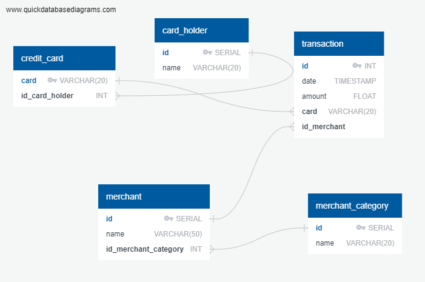

# Fraud Detection SQL

## Background

Fraud is a prevalent issue in various businesses, and detecting fraudulent transactions is crucial to minimize financial losses. In this project, we will apply SQL skills to analyze historical credit card transactions and consumption patterns to identify possible fraudulent activities.

The tasks to be accomplished are as follows:

1. **Data Modeling:** Define a database model to store credit card transaction data and create a new PostgreSQL database using the model.

2. **Data Engineering:** Create a database schema in PostgreSQL and populate the database with data from CSV files.

3. **Data Analysis:** Analyze the data to identify possible fraudulent transactions.

## Files

### Query Files

- **schema.sql:** Contains SQL queries to create the database schema with tables and relationships.
- **seed.sql:** Contains SQL queries to populate the database with data from CSV files.

### CSV Files

- **card_holder.csv:** Contains data about credit card holders.
- **credit_card.csv:** Contains data about credit cards.
- **merchant_category.csv:** Contains data about merchant categories.
- **merchant.csv:** Contains data about merchants.
- **transaction.csv:** Contains data about credit card transactions.

## Data Modeling

We will create an entity relationship diagram (ERD) by inspecting the provided CSV files. The ERD will serve as a blueprint for our database model. We will use the tool "Quick Database Diagrams" to develop the ERD.

## Data Engineering

Using the ERD as a guide, we will create a database schema with tables, specifying data types, primary keys, foreign keys, and other constraints as defined in the ERD. After creating the schema, we will import data from the corresponding CSV files into the database.

## Data Analysis

With the data prepared in the database, we will proceed to identify fraudulent transactions using SQL and Pandas DataFrames. We will perform the following analyses:

1. Identify the top 100 highest transactions during early hours (7:00 to 9:00 AM).
2. Count the transactions that are less than $2.00 per cardholder to identify potential hacking.
3. Determine the top five merchants prone to being hacked using small transactions.
4. Create views for the reusable queries.

Next, we will create a report for fraudulent transactions of some top customers using Pandas, Plotly Express, hvPlot, and SQLAlchemy to visualize the data.

- Fraudulent transactions for two important customers (ID 18 and ID 2) will be analyzed in detail to understand their consumption patterns and susceptibility to fraud.

Finally, we will investigate anomalous transactions during the first quarter of 2018 for a specific cardholder (ID 25) using Plotly Express to create box plots for each month.

## Challenge

As an additional approach to identifying fraudulent transactions, we will explore outlier detection using standard deviation and interquartile range (IQR). These methods are commonly used to detect outliers in data.
