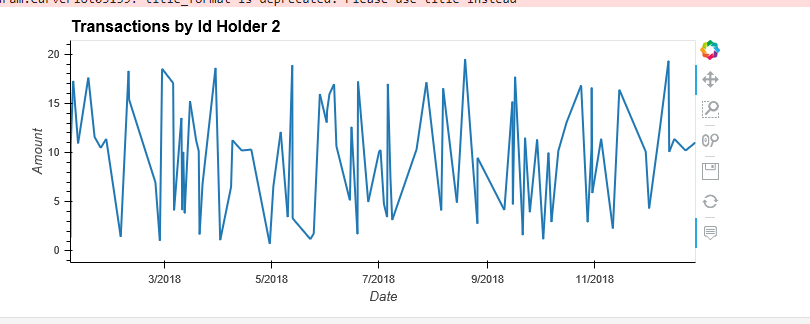
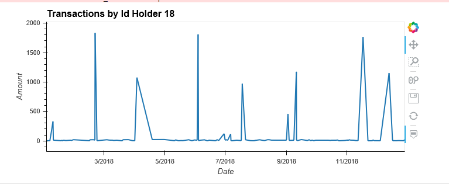
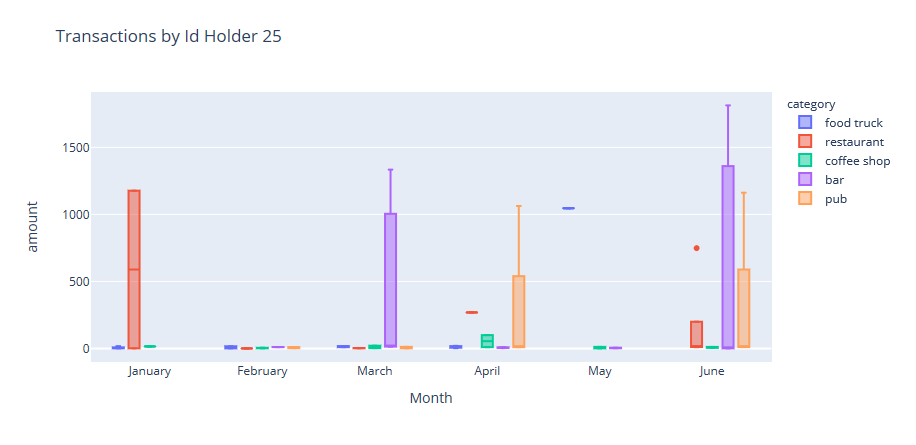
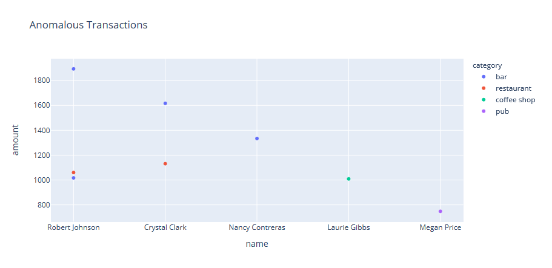

# Fraud Detection SQL

*[Credit Card Fraudster by Richard Patterson](https://www.flickr.com/photos/136770128@N07/42252105582/) | [Creative Commons Licensed](https://creativecommons.org/licenses/by/2.0/)*

## Background

Fraud is a prevalent issue in various businesses, and detecting fraudulent transactions is crucial to minimize financial losses. While emerging technologies like machine learning and artificial intelligence are employed for fraud detection, strong data analytics is still necessary to identify abnormal charges.

In this project, we will apply SQL skills to analyze historical credit card transactions and consumption patterns to identify possible fraudulent activities.

## Tasks

### Data Modeling

We start by defining a database model to store credit card transaction data and create a new PostgreSQL database using the model. We will inspect the provided CSV files and create an entity relationship diagram (ERD) using [Quick Database Diagrams](https://app.quickdatabasediagrams.com/#/).

**Note:** The `card` column in the `credit_card` table should be a VARCHAR(20) datatype rather than an INT.

### Data Engineering

With the ERD as a blueprint, we will create a database schema for each table, specifying data types, primary keys, foreign keys, and other constraints. After creating the schema, we will import data from the corresponding CSV files into the PostgreSQL database.

### Data Analysis

Now that the data is prepared within the database, we can identify fraudulent transactions using SQL and Pandas DataFrames.

1. **Top 100 Highest Transactions during Early Hours:** We will identify the 100 highest transactions that occurred between 7:00 to 9:00 AM.

2. **Count Small Transactions per Cardholder:** Some fraudsters hack credit cards by making several small payments (usually less than $2.00) that are often ignored by cardholders. We will count the transactions that are less than $2.00 per cardholder to check for potential hacking evidence.

3. **Top Five Merchants Prone to Small Transactions Hacking:** We will determine the top five merchants that are most susceptible to being hacked using small transactions.

4. **Creating Views:** Once we have reusable queries, we will create views for each of the previous queries.

### Data Analysis with Visualizations

We will create a report for fraudulent transactions of some top customers using Pandas, Plotly Express, hvPlot, and SQLAlchemy to visualize the data.

1. **Fraudulent Transactions for Top Customers (ID 18 and ID 2):** We will analyze the history of fraudulent transactions for two important customers based on their cardholders' IDs (ID 18 and ID 2).

   
   

   *Observation:* The consumption pattern for both ID holders is different. ID Holder 2 has numerous small transactions, while ID Holder 18 has transactions ranging up to $1839. ID Holder 2 is more susceptible to fraudulent transactions.

2. **Anomalous Transactions for Cardholder ID 25 (CEO of Firm's Biggest Customer):** The CEO of the firm's biggest customer suspects unauthorized usage of her corporate credit card during the first quarter of 2018 to pay for expensive restaurant bills. We will find any anomalous transactions during that period using Plotly Express to create box plots for each month.

   

   *Observation:* There seem to be fraudulent transactions in the Restaurant & Food Truck category, where Food Truck transactions range from $1.46 to $1046.

### Challenge

We will explore another approach to identify fraudulent transactions by looking for outliers in the data using standard deviation and interquartile range (IQR).

#### Identifying Outliers based on Standard Deviation

#### Identifying Outliers based on Interquartile Range

*Elaboration:* In this challenge, we will use statistical methods like standard deviation and IQR to detect outliers, which may indicate fraudulent transactions.

